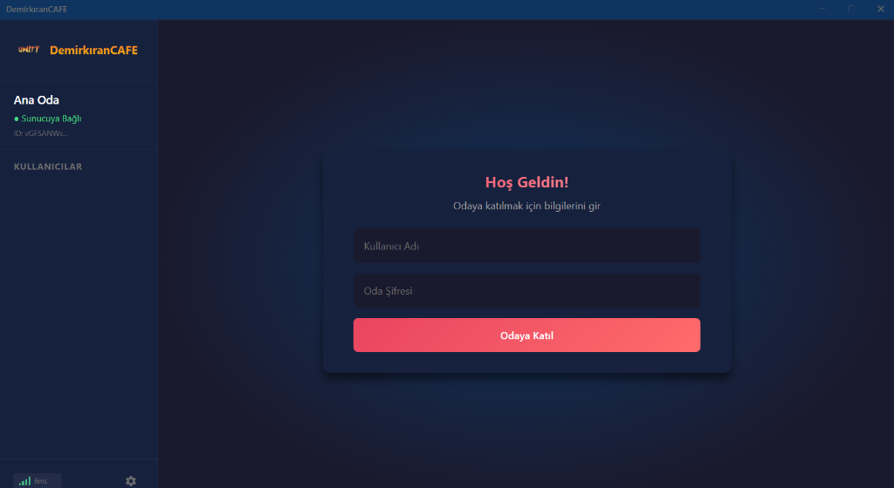
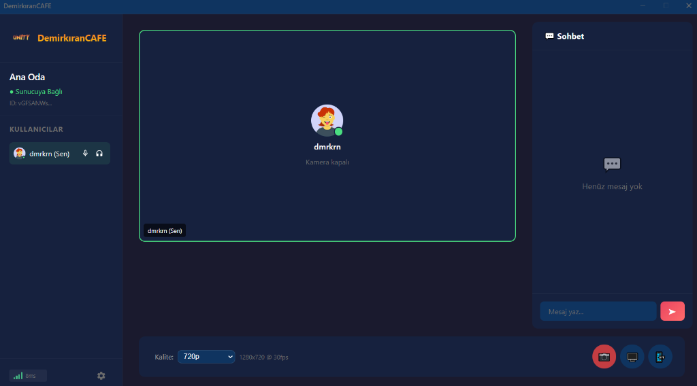
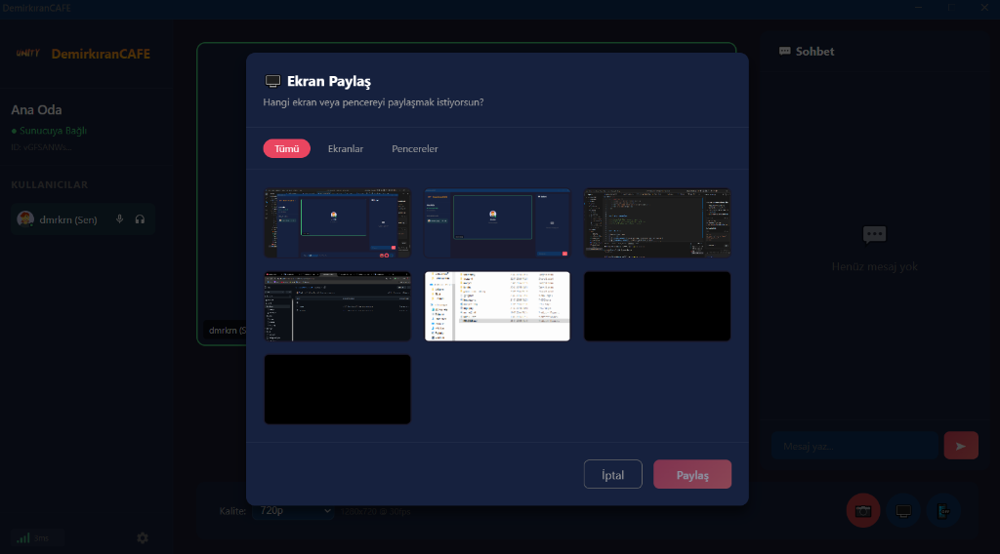
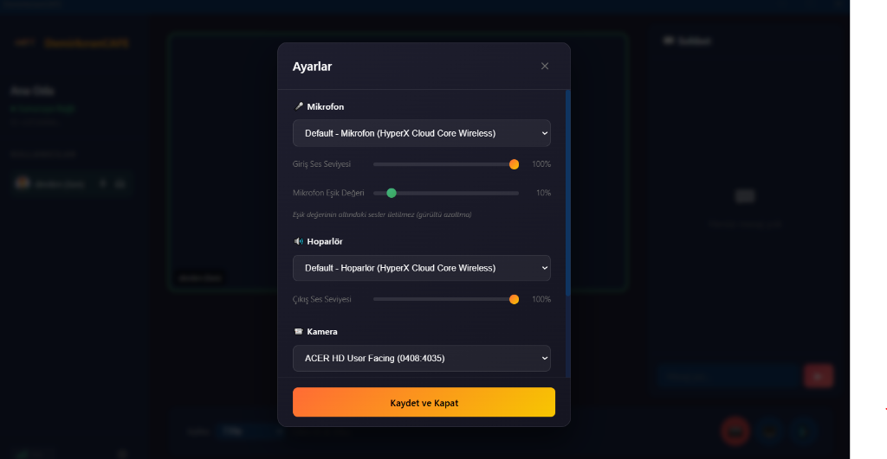
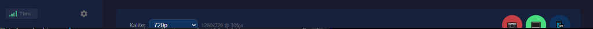

<h1 align="center">DemirkiranCAFE</h1>

<p align="center">
  <strong>🎮 Arkadaşlar arası sesli/görüntülü iletişim uygulaması</strong>
</p>

<p align="center">
  
  
  
</p>

<p align="center">
  <a href="#-özellikler">Özellikler</a> •
  <a href="#-kurulum">Kurulum</a> •
  <a href="#%EF%B8%8F-teknolojiler">Teknolojiler</a> •
  <a href="#-mimari">Mimari</a>
</p>

---

## 📸 Ekran Görüntüleri

<div align="center">
  
  
</div>
<div align="center">
  
  
</div>
<div align="center">
  <br/>
  <h3>Yeni Arayüz (v1.0.7)</h3>
  
</div>

---

## ✨ Özellikler

| Özellik | Açıklama |
|---------|----------|
| 🎤 **Sesli Sohbet** | Düşük gecikmeli, yüksek kaliteli ses iletimi |
| 📹 **Görüntülü Sohbet** | 1080p'ye kadar video kalitesi |
| 🖥️ **Ekran Paylaşımı** | Oyun, uygulama veya tam ekran paylaşımı |
| 👥 **10 Kullanıcı** | Eşzamanlı 10 kişiye kadar destek |
| 🔐 **Şifre Koruması** | Özel oda erişimi için şifre sistemi |
| 🔄 **Otomatik Güncelleme** | Yeni sürümler otomatik indirilir |
| 🎨 **Modern Arayüz** | Discord benzeri koyu tema tasarım |
| ⌨️ **Kısayol Tuşları** | M: Mikrofon, D: Sağır modu |

---

## 🚀 Kurulum

### Kullanıcılar İçin (Hazır Uygulama)

1. [Releases](https://github.com/Dmrkrn/demirkiranCAFE/releases) sayfasından son sürümü indir
2. `DemirkiranCAFE Setup X.X.X.exe` dosyasını çalıştır
3. Kurulumu tamamla ve uygulamayı aç
4. Kullanıcı adı ve oda şifresini girerek bağlan

### Geliştiriciler İçin

#### Gereksinimler
- Node.js 18+ 
- Python 3.x (mediasoup build için)
- Visual Studio Build Tools

#### Backend
```bash
cd backend
npm install
npm run start:dev
```

#### Client
```bash
cd client
npm install
npm run electron:dev
```

#### Production Build
```bash
cd client
npm run electron:build
```

---

## 🛠️ Teknolojiler

### Backend
| Teknoloji | Kullanım |
|-----------|----------|
| **NestJS** | Backend framework |
| **mediasoup** | SFU (Selective Forwarding Unit) |
| **Socket.io** | WebSocket signaling |
| **TypeScript** | Tip güvenliği |

### Frontend
| Teknoloji | Kullanım |
|-----------|----------|
| **Electron** | Masaüstü uygulaması |
| **React 19** | UI framework |
| **Vite** | Build tool |
| **mediasoup-client** | WebRTC client |
| **TypeScript** | Tip güvenliği |

### Altyapı
| Teknoloji | Kullanım |
|-----------|----------|
| **WebRTC** | Peer-to-peer medya iletimi |
| **DTLS/SRTP** | Şifreli medya aktarımı |
| **electron-updater** | Otomatik güncelleme |
| **electron-builder** | Cross-platform build |

---

## 🏗️ Mimari

```
┌─────────────────────────────────────────────────────────────┐
│                     DemirkiranCAFE                          │
├─────────────────────────────────────────────────────────────┤
│                                                             │
│  ┌─────────────┐     WebSocket      ┌─────────────────┐    │
│  │   Client 1  │◄──────────────────►│                 │    │
│  │  (Electron) │     (Signaling)    │                 │    │
│  └─────────────┘                    │                 │    │
│         │                           │   NestJS +      │    │
│         │ WebRTC/UDP                │   mediasoup     │    │
│         │ (Media)                   │   (SFU Server)  │    │
│         ▼                           │                 │    │
│  ┌─────────────┐     WebRTC/UDP     │                 │    │
│  │   Client 2  │◄──────────────────►│                 │    │
│  └─────────────┘                    │                 │    │
│         │                           │                 │    │
│         ▼                           │                 │    │
│  ┌─────────────┐     WebRTC/UDP     │                 │    │
│  │   Client N  │◄──────────────────►│                 │    │
│  └─────────────┘                    └─────────────────┘    │
│                                                             │
└─────────────────────────────────────────────────────────────┘
```

### SFU (Selective Forwarding Unit) Avantajları

- ✅ **Düşük CPU kullanımı** - Sunucu transkod yapmaz
- ✅ **Düşük gecikme** - Direkt yönlendirme
- ✅ **Ölçeklenebilir** - Çok kullanıcı desteği
- ✅ **Kalite kontrolü** - Simulcast/SVC desteği

---

## 📁 Proje Yapısı

```
demirkiranCAFE/
├── backend/                    # NestJS Backend
│   ├── src/
│   │   ├── mediasoup/         # SFU + Signaling
│   │   └── main.ts            # Entry point
│   └── package.json
│
├── client/                     # Electron + React Client
│   ├── electron/              # Electron main process
│   │   ├── main.js
│   │   └── preload.js
│   ├── src/
│   │   ├── components/        # React bileşenleri
│   │   ├── hooks/             # Custom hooks
│   │   ├── styles/            # CSS dosyaları
│   │   └── App.tsx            # Ana bileşen
│   ├── public/                # Statik dosyalar
│   └── package.json
│
└── README.md
```

---

## ⌨️ Kısayol Tuşları

| Tuş | İşlev |
|-----|-------|
| `M` | Mikrofonu aç/kapat |
| `D` | Sağır modunu aç/kapat |

---

## 🔧 Yapılandırma

### Backend Bağlantı Adresi
`client/src/hooks/useSocket.ts` dosyasında:
```typescript
const SOCKET_URL = 'http://localhost:3000';
```

### Oda Şifresi
`backend/.env` dosyasını oluşturun ve şifreyi belirleyin:
```env
ROOM_PASSWORD=istediğiniz_zor_sifre
```

---

## 📝 Güncelleme Geçmişi

### v1.0.7 (2026-02-02)
- 🎨 **Arayüz İyileştirmeleri**: İkonlar yenilendi ve hizalama sorunları giderildi.
- 🎛️ **Gelişmiş Ses Kontrolü**: Kullanıcı bazlı ses seviyesi ayarı eklendi.
- 🖥️ **Tam Ekran Modu**: Videolara tıklayarak tam ekran yapabilme özelliği.
- 🎤 **Mikrofon Testi**: Ayarlar panelinde görsel mikrofon testi ve loopback özelliği.
- 🐛 **Hata Düzeltmeleri**: Layout kaymaları ve build sorunları giderildi.

### v1.0.0 (2026-02-01)
- 🎉 İlk beta sürümü
- ✅ Sesli/görüntülü sohbet
- ✅ Ekran paylaşımı
- ✅ Oda şifresi koruması
- ✅ Otomatik güncelleme sistemi
- ✅ Modern kullanıcı arayüzü

---

## 👨‍💻 Geliştirici

**Dmrkrn**

- GitHub: [@Dmrkrn](https://github.com/Dmrkrn)
- LinkedIn: [@Dmrkrn](https://www.linkedin.com/in/dmrkrn/)
- Portfolio: [@Dmrkrn](https://dmrkrn.com/)

---

## 📄 Lisans

Bu proje [MIT](LICENSE) lisansı altında lisanslanmıştır.

---