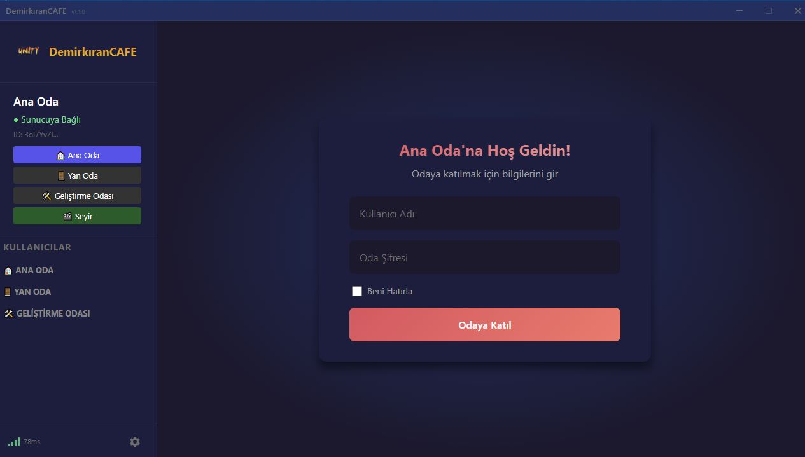
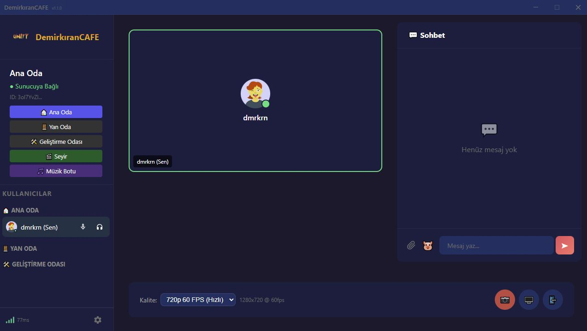
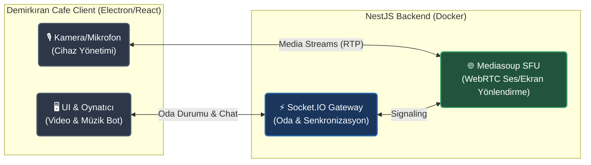
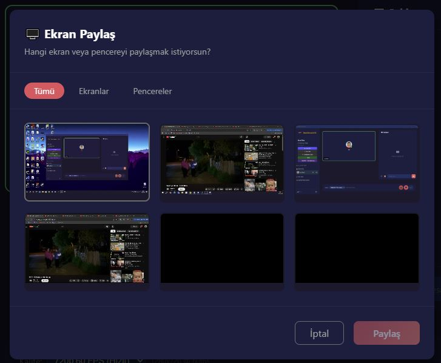
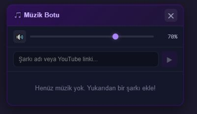
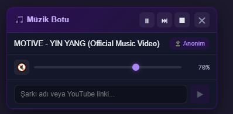
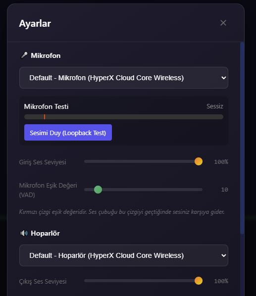
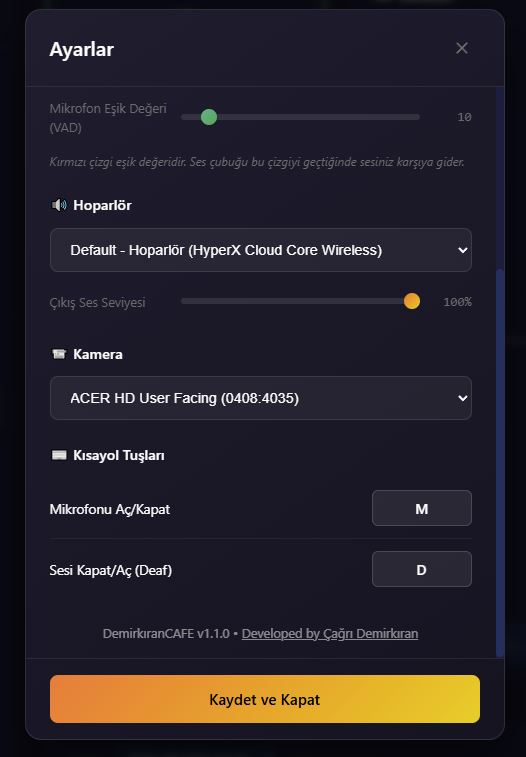

<div align="center">

# Demirkıran Cafe

Demirkıran Cafe, oyuncular ve arkadaş grupları için geliştirilmiş Discord benzeri, **özel sunucu mantığıyla çalışan** iletişim için kullanılan bir masaüstü uygulamasıdır.


[English Version Below](#english-version) 🇺🇸

</div>

---

<br/>
<div align="center">
  
  
</div>
<br/>

## 🎯 Özellikler (Features)

*   **🎬 Senkronize Müzik & Video Botu:** 
    * YouTube videolarını ve müziklerini odadaki herkesle *aynı anda, senkronize* dinleyin.
    * Herkesin eklenti yapabildiği global bir kuyruk sistemi.
    * Şarkıların sırasını değiştirmek için **Sürükle & Bırak (Drag & Drop)** özelliği.
    * İstemci taraflı **Kalıcı Ses Ayarı (Persistent Volume)** ile kendi Müzik Botu sesinizi kısıp açabilirsiniz (tercihiniz hafızaya alınır).
*   **🎮 Ekran Paylaşımı (Ekran & Pencere):**
    * 1080p 60FPS'e kadar donanım hızlandırmalı sistem veya uygulama sesleriyle birlikte ekran paylaşımı.
    * Ekran paylaşımlarında "Tam Ekran Yap" özelliği.
*   **🎙️ Sesli Sohbet (Voice Chat) & Mediasoup SFU:**
    * Düşük gecikmeli, minimum bant genişliği tüketen **Mediasoup SFU** altyapısıyla Discord kalitesinde sesli görüşme.
    * Konuşan kullanıcıyı vurgulama (Yeşil Çerçeve).
*   **🎛️ Bireysel Ses Kontrolleri:** 
    * Discord'da olduğu gibi odadaki her kullanıcının sesini diğerlerinden bağımsız şekilde ayrı ayrı kısıp açabilirsiniz.
*   **⌨️ Global Kısayol Tuşları (Hotkeys):**
    * uIOhook altyapısıyla oyun oynarken arkaplanda çalışsa bile mikrofonu `M`, hoparlörü `D` tuşu ile kapatıp açabilirsiniz (Kısayollar Türkçe Q klayveyi destekler ve değiştirilebilir).
*   **💬 Gerçek Zamanlı Sohbet:**
    * Modern Web soketleriyle anında mesajlaşma.

---

## 🛠️ Mimari (Architecture)

Uygulama arka planda gerçek zamanlı iletişim için yüksek performanslı bir SFU (Selective Forwarding Unit) mimarisi kullanır. Geleneksel P2P yönteminden farklı olarak medya (ses/görüntü) sunucuya **sadece 1 kez iletilir** ve sunucu bunu diğer katılımcılara dağıtır.


```mermaid
graph LR
    %% Stil Tanımlamaları
    classDef client fill:#2d3748,stroke:#4a5568,stroke-width:2px,color:#fff
    classDef backend fill:#1a365d,stroke:#2b6cb0,stroke-width:2px,color:#fff
    classDef mediasoup fill:#22543d,stroke:#38a169,stroke-width:2px,color:#fff
    classDef db fill:#5f370e,stroke:#d69e2e,stroke-width:2px,color:#fff

    subgraph "Demirkıran Cafe Client (Electron/React)"
        direction TB
        UI("🖥️ UI & Oynatıcı<br/>(Video & Müzik Bot)"):::client
        Media("🎙️ Kamera/Mikrofon<br/>(Cihaz Yönetimi)"):::client
    end

    subgraph "NestJS Backend (Docker)"
        direction TB
        Socket("⚡ Socket.IO Gateway<br/>(Oda & Senkronizasyon)"):::backend
        SFU("🌐 Mediasoup SFU<br/>(WebRTC Ses/Ekran Yönlendirme)"):::mediasoup
    end

    UI <--"Oda Durumu & Chat"--> Socket
    Media <--"Media Streams (RTP)"--> SFU
    Socket <--"Signaling"--> SFU
```

---

## 📸 Ekran Görüntüleri (Screenshots)

### Ekran Paylaşımı & Sohbet
<div align="center">
  
</div>

### Müzik Botu
<div align="center">
  
  <br/><br/>
  
</div>

### Gelişmiş Ayarlar & Hotkey Atama
<div align="center">
  
  <br/><br/>
  
</div>

---

## 🚀 Kurulum (Kurumsal / Geliştirici)

### 1. Backend (Sunucu) Kurulumu (Docker ile Önerilir)

En hızlı kurulum için Docker kullanın. Backend tarafı NestJS ve C++ Mediasoup Core Worker'larını içerir. 

Sunucunuzda **Mediasoup için UDP/TCP portlarının (50000-50200)** güvenlik duvarından açık olduğundan emin olun.
```bash
cd backend
npm install
npm run start:dev
# veya Docker ile: docker-compose up -d --build
```

### 2. Client (İstemci) Kurulumu

```bash
cd client
npm install

# Geliştirici Modunda çalıştırmak için iki terminal kullanın:
npm run dev # Terminal 1 (Vite)
npm run start # Terminal 2 (Electron)

# Uygulamayı Paketlemek (Production Build .exe) ve Dağıtmak için:
npm run electron:build
```

---
<br/>
<br/>

<div align="center">
  <h1 id="english-version">🇬🇧 English Version</h1>
</div>

# Demirkıran Cafe

Demirkıran Cafe is a privately hosted, Discord-like communication app designed for gamers and friend groups. It provides low-latency voice chat, screen sharing, and synchronized music/video watching capabilities using a dedicated server architecture.

## 🎯 Features

*   **🎬 Synchronized Music Bot:** 
    * Add YouTube videos and music links to a global queue and listen to them in perfect sync with everyone in the room.
    * **Drag & Drop** queue items to re-organize the playing sequence on the fly.
    * Features local, **Persistent Volume Control** specifically for the bot (remembers your slider position).
*   **🎮 Hardware-Accelerated Screen Share:**
    * Liquid smooth game and desktop sharing over WebRTC with full system audio forwarding.
*   **🎙️ Low-Latency Voice Chat (Mediasoup SFU):**
    * Powered by an optimized Mediasoup Selective Forwarding Unit infrastructure. Instead of crashing bandwidth via Peer-to-Peer, users upload their stream once, and the server distributes it instantly.
    * Audio-reactive speaker indicators (Green borders).
*   **🎛️ Per-User Volume Controls:** 
    * Lower or raise the specific volume of any individual participant in the room independently.
*   **⌨️ Global Hotkeys:**
    * Keep working or playing your games in peace. Thanks to low-level `uIOhook` bindings, you can toggle your microphone (`M`) or deafen yourself (`D`) globally from anywhere in the OS.
*   **💬 Real-Time Chat:**
    * Instant messaging alongside the video feeds.

## 🛠️ Architecture

*(See the Mermaid diagram in the Turkish section above for visualization)*

The application uses an **SFU (Selective Forwarding Unit)** architecture for real-time media routing. WebRTC (Mediasoup) handles the media payload directly in the C++ layer, while WebSocket (Socket.IO/NestJS) manages the signaling states and synchronized events.

## 📸 Screenshots

- See **[Screenshots Section](#-ekran-görüntüleri-screenshots)** above for UI comparisons featuring voice channels, settings panels, music bot configurations, and dynamic themes.

## 🚀 Installation

### 1. Backend (Server Setup)
**Critical note for DevOps:** Mediasoup requires UDP port ranges to be accessible through your firewall (default `50000-50200`).
```bash
cd backend
npm install
npm run start:dev
# Or using Docker: docker-compose up -d --build
```

### 2. Client (Desktop Setup)
```bash
cd client
npm install
npm run electron:dev # Runs the dev environment

# To compile to a distributable .exe:
npm run electron:build
```

---

<div align="center">
  <h3>👨‍💻 Developer</h3>
  <b>Dmrkrn</b><br>
  <a href="https://github.com/Dmrkrn">GitHub</a> • 
  <a href="https://www.linkedin.com/in/dmrkrn/">LinkedIn</a> • 
  <a href="https://dmrkrn.com/">Portfolio</a>
  <br><br>
  <i>Licensed under the MIT License.</i>
</div>
